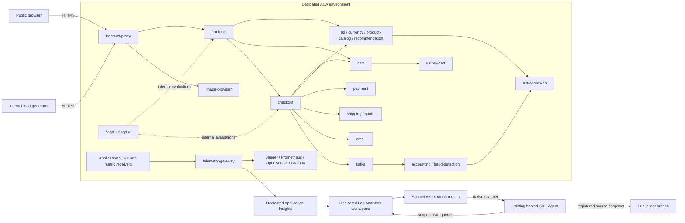

# Architecture and resource inventory

Start with [the clean-clone quickstart](QUICKSTART.md), then
[the safe demo walkthrough](DEMO.md). This is the real Astronomy Shop:
`compose.yaml`, `compose.full.yaml` and `compose.observability.yaml` are translated
together. The inventory test rejects upstream additions/removals until the ACA
mapping is reviewed. No replacement application or investigator is deployed.

The diagram groups services; it is not a replacement dependency manifest.
`prepare.py` preserves Compose dependencies and `Deploy.ps1` starts their
topological waves only after real main-container readiness. There are **27 apps
and 28 service containers**, plus the one flag-seeding init container.

## Azure resources

| Resource | Default name / count | Purpose and lifecycle |
| --- | --- | --- |
| Resource group | Operator-selected | Prefer a new dedicated group; never delete a shared group |
| ACA environment | `<prefix>-env`, one | Consumption networking and app isolation boundary |
| Log Analytics | `<prefix>-logs`, one | Application records and ACA logs; 30-day retention, 1 GB/day cap |
| Application Insights | `<prefix>-insights`, one | Application monitoring, linked to the dedicated workspace |
| Container Apps | Names below, 27 | Single-replica upstream services and local observability |
| Scheduled query rules | Two operator-selected names | Sev2 failures and telemetry gaps; separate authorized setup |
| SRE Agent | Existing operator-selected resource | Native UI, health prompt, incident handling and source registration |
| SRE identity/self-telemetry | Existing, not managed here | Not an application data source or deployment target |

Azure can also create an Application Insights smart-detection rule. Inventory it
before cleanup; it is not one of the custom incident rules. No ACR, dedicated
node pool, managed database, VM, AKS cluster, second agent, model deployment or
role assignment is created by the app template.

## Complete service mapping

| App(s) | Internal port(s) | Purpose / principal dependencies |
| --- | --- | --- |
| `frontend-proxy` | 8080; public TLS ingress | Routes only shop and image traffic |
| `frontend` | 8080 | Shop API/UI; business-service gRPC clients |
| `ad` | 9555, 9465 | Ads, flag evaluation, Prometheus metrics |
| `cart` | 7070 | Cart API; Valkey and flagd |
| `checkout` | 5050 | Order orchestration; cart/catalog/currency/payment/shipping/email/Kafka |
| `currency` | 7001 | Currency conversion |
| `email` | 6060 | Synthetic confirmation email service; no external email connector |
| `payment` | 50051 | Synthetic payment fixture; no real transaction provider |
| `product-catalog` | 3550 | Catalog backed by PostgreSQL |
| `recommendation` | 9001 | Recommendations; product catalog and flagd |
| `shipping` / `quote` | 50050 / 8090 | Shipping and quote calculation |
| `image-provider` | 8081 | Product images and nginx metrics |
| `accounting` / `fraud-detection` | No ingress | Kafka consumers; accounting writes PostgreSQL |
| `kafka` | 9092 | Orders; controller stays local to the replica |
| `astronomy-db` | 5432 | Upstream catalog/accounting schema and seed data |
| `valkey-cart` | 6379 | Cart state |
| `flagd` (with `flagd-ui`) | 8013, 8015, 8016, 4000 | Flag evaluation/sync/UI; shared writable all-off configuration |
| `load-generator` | 8089, internal only | Upstream Locust/browser traffic; five users |
| `telemetry-gateway` | 4317, 4318 | Upstream `otel-collector` container; OTLP and receiver pipelines |
| `jaeger` | 4317, 16686 | Local traces; query base path `/jaeger/ui` |
| `prometheus` / `grafana` | 9090 / 3000 | Local metrics and dashboards |
| `opensearch` | 9200 | Local logs with isolated key encoding |
| `opamp-server` | 4320, 4321 | Internal instrumentation management |
| `telemetry-docs` | 8000 | Upstream generated telemetry documentation |

App names deliberately remain the upstream names, except `telemetry-gateway`.
`--prefix` changes the three dedicated Azure resource names, **not app names**.
Whole-service renaming is not supported or advertised. Use a different resource
group for another deployment; the deployer rejects unowned name collisions.

## Network, data and identity boundaries

Business gRPC and other TCP protocols use ACA service-name discovery. An
`*.internal.<environment-domain>` HTTP ingress FQDN is not a TCP service address.
The gateway alone is public. Databases, OTLP, local dashboards, flag management,
load controls and OpAMP are not public routes. Public browser OTLP is unsupported;
server-side telemetry is the primary baseline.

App SDKs send traces/logs/metrics to contrib 0.159.0. The `azure_monitor` exporter
is beta. Jaeger, Prometheus and OpenSearch remain separate internal export paths.
OpenSearch flat log keys encode `%` and `.` to avoid mapping collisions; the
Azure path preserves original semantic-convention attribute names.

Service identity, image version, source context, deployment ID and configuration
digest are different evidence dimensions. Native SDK instance IDs are preserved,
and missing IDs are not replaced by a fictitious collector instance. Immutable
image digests do not prove the image was built from the fork's source commit.

Runtime passwords and connection strings travel via secure ARM parameters and
ACA secrets, never public outputs. Generated files must be outside the checkout.
All local database, queue, cache, flag and observability volumes are disposable.
Rolling revisions can reset state; there is no HA or backup promise.

The existing SRE Agent reads only the intended app environment and dedicated
telemetry. It does not monitor its own telemetry as shop evidence. Review mode
and requested read-only tools are not strict IAM isolation. Existing broad
inherited permissions are not silently narrowed or expanded by these scripts.
See [SRE setup and source freshness](SRE.md).

| Identity / actor | Needed access | Boundary |
| --- | --- | --- |
| Human using Azure CLI | App RG deployment, dedicated workspace query, separately authorized SRE configuration | Explicit subscription/resource IDs; no shared defaults changed |
| Agent onboarding administrator | Current service-required role-assignment rights | Human-controlled grants, not part of this repo's deployment |
| SRE runtime managed identity | Resource/query access and native incident lifecycle requirements | Inspect configured action/knowledge identity; never assume system identity |
| Human approver | Decisions on spend, test activation, source recreation and publication | No unattended consent, deletion, notification or remediation |

The commissioned agent inherited Monitoring Contributor, which is broader than
the requested read-only prompt scope. No role assignment was changed to conceal
that limitation. An agent's own resource group/telemetry can be separate from
the app group; neither is a shop dependency to recreate.
Native alert acknowledgment is possible; no automatic application remediation
does not mean zero incident-metadata state changes.

## Implemented versus future work

Implemented: healthy multi-service baseline, real checkout and correlated
telemetry, scoped native health/incident investigation, permanent alert rules,
and controlled synthetic routing verification.

Not implemented: a real fault exercise, autonomous remediation, production
actions, ICM/Teams/support connectors, postmortem publication, repair-item
creation, or a complete incident-to-postmortem workflow. Those require separate
scope, credentials/tool policies and explicit operator authorization.
